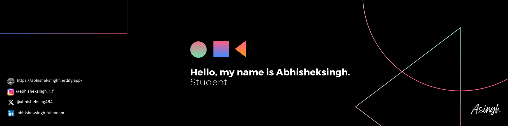

<h1> Hello Fellow < Developers/ >!  </h1>

 Hi! My name is Abhisheksingh. I Love to code :smile: 

<h2> About Me </h2>

- 🔭 I’m currently working on Improving my Competitive Coding Skills

- 🌱 I’m currently learning React, AI and Cloud Computing Technologies 

- 👯 I’m looking to collaborate on Projects 

- 💬 Talk to me about Coding, Movies, Cricket 

<h2> Skills  </h2>

<h2> Connect with me  </h2>
 
 
 
 
 

 

<h2> My GitHub Stats  </h2>

### 🔥 &nbsp; My Stats :
   
   
  

